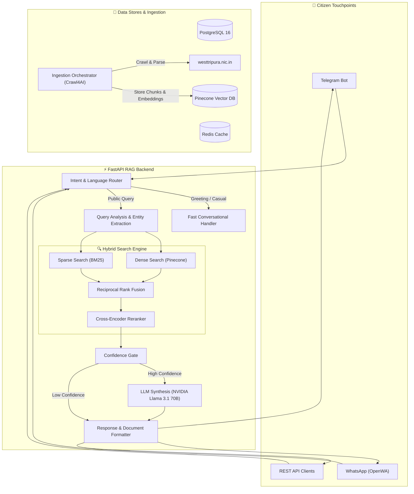

# 🏛️ West Tripura Citizen RAG & Document Assistant

[](https://www.python.org/)
[](https://fastapi.tiangolo.com/)
[](https://www.postgresql.org/)
[](https://redis.io/)
[](https://www.docker.com/)
[](https://www.pinecone.io/)

> **An enterprise-grade, self-hostable Retrieval-Augmented Generation (RAG) platform and multi-channel conversational assistant designed for the District Administration of West Tripura.**

It automatically ingests, indexes, and delivers official government notifications, public services, schemes, administrative contacts, and application forms directly to citizens via **WhatsApp**, **Telegram**, and **REST APIs**.

---

## 📋 Table of Contents
- [Executive Overview](#-executive-overview)
- [Key Architectural Capabilities](#-key-architectural-capabilities)
- [System Architecture & Flow](#-system-architecture--flow)
- [Repository Structure](#-repository-structure)
- [Technical Stack](#-technical-stack)
- [Quick Start & Deployment](#-quick-start--deployment)
- [Knowledge Base Ingestion Pipeline](#-knowledge-base-ingestion-pipeline)
- [API Reference](#-api-reference)
- [Operator Runbook (NIC / System Admins)](#-operator-runbook-nic--system-admins)
- [Troubleshooting & Support](#-troubleshooting--support)
- [License](#-license)

---

## 🎯 Executive Overview

Navigating official municipal and district websites to find service procedures, eligibility criteria, and downloadable application forms is often complex for citizens. The **West Tripura Citizen RAG Assistant** bridges this gap by turning the official district portal ([https://westtripura.nic.in/](https://westtripura.nic.in/)) into an interactive, zero-hallucination conversational interface.

### Key Value Propositions
* **Zero-Hallucination Grounding**: Instructed strictly to ground answers in verified official context. Missing information triggers explicit fallback/verification steps rather than fabricated facts.
* **Multilingual Citizen Experience**: Supports query understanding in **Bengali**, **English**, and **Benglish** (Bengali written in Latin script).
* **Direct Official Document Delivery**: Discovers and indexes official PDFs, Word forms, Excel sheets, and CSVs, serving direct download links to citizens.
* **Multi-Channel Availability**: Operates seamlessly across Telegram and WhatsApp (via OpenWA integration).

---

## ⚡ Key Architectural Capabilities

| Feature | Description |
| :--- | :--- |
| 🔀 **Smart Query Routing** | Fast-path routing bypasses heavy vector search for standard greetings while routing domain questions to the RAG pipeline. |
| 🔍 **Hybrid Retrieval Engine** | Combines **Dense Vector Search** (NVIDIA `nv-embed-v1` / Pinecone) + **Sparse Lexical Search** (BM25) via **Reciprocal Rank Fusion (RRF)**. |
| 🎯 **Cross-Encoder Reranking** | Re-scores RRF candidates using neural cross-encoders to ensure highest-relevance evidence reaches the context window. |
| 🛡️ **Confidence-Based Guardrails** | Multi-tier validation: High-confidence answers deliver grounded RAG context; low-confidence queries trigger safe general LLM fallbacks. |
| 📄 **Automated Materialization** | Discovers, downloads, parses, and embeds official documents linked within district web pages. |
| 🔄 **Resumable Ingestion** | Full web crawler (`Crawl4AI`) featuring checkpoint recovery, rate limiting, and structure-aware markdown parsing. |

---

## 🏗️ System Architecture & Flow



---

## 📂 Repository Structure

```text
west-tripura-testing/
├── backend/                         # Core FastAPI Web Application
│   ├── main.py                      # Application Entrypoint
│   ├── api/v1/                      # REST Endpoints (RAG, Ingestion, Health)
│   ├── core/                        # Application Config & Settings
│   ├── db/                          # Database Connections & ORM Models
│   ├── middleware/                  # Auth, Logging, & Rate Limiting
│   ├── schemas/                     # Pydantic Schemas & DTOs
│   └── services/                    # Business Logic Layer
│       ├── confidence_service.py    # Grounding & Verification Logic
│       ├── document_resolver.py     # Document Matching & Link Resolver
│       ├── intent_router.py         # Fast Path & Query Classification
│       ├── query_analysis.py        # Entity & Keyword Extraction
│       ├── rag_service.py           # RAG Pipeline Orchestrator
│       ├── reranker_service.py      # Neural Cross-Encoder Reranking
│       ├── retrieval_service.py     # Hybrid Dense + Sparse Search Engine
│       └── providers/               # Abstracted Modular Service Providers
│           ├── bm25_retriever.py    # Local Sparse Keyword Search
│           ├── embedding.py         # NVIDIA / OpenAI / BGE Embeddings
│           ├── llm.py               # NVIDIA Llama 3.1 70B / OpenAI LLM
│           └── vector_store.py      # Pinecone / Qdrant Integration
│
├── src/ingestion/                   # Knowledge Base Ingestion Pipeline
│   ├── auto_ingest.py               # Master One-Command Ingestion CLI
│   ├── crawler.py                   # Crawl4AI District Web Crawler
│   ├── materialize_documents.py     # Document Discovery & Materializer
│   ├── embed_and_load.py            # Vector Index Builder
│   └── core/                        # Preprocessing & Semantic Chunker
│
├── telegram_bot.py                  # Telegram Interface Service
├── whatsapp_bot.py                  # OpenWA WhatsApp Gateway Interface
├── docker-compose.yml               # Production Container Orchestration
├── Dockerfile                       # Python Application Docker Image
├── requirements.txt                  # Production Runtime Dependencies
├── requirements-ingestion.txt       # Ingestion & Scraping Dependencies
└── README.md
```

---

## 🛠️ Technical Stack

- **Backend Framework**: [FastAPI](https://fastapi.tiangolo.com/) (Python 3.12, Uvicorn, Pydantic v2)
- **Database**: [PostgreSQL 16](https://www.postgresql.org/) (AsyncPG, SQLAlchemy ORM)
- **Caching & Rate Limiting**: [Redis 7](https://redis.io/)
- **Vector Database**: [Pinecone](https://www.pinecone.io/) (Dense embeddings: `nv-embed-v1`, 4096 dimensions)
- **Large Language Model**: NVIDIA API Catalog ([Meta Llama-3.1-70B-Instruct](https://build.nvidia.com/meta/llama-3_1-70b-instruct))
- **Web Crawler**: [Crawl4AI](https://github.com/unclecode/crawl4ai)
- **Messaging Gateways**: Telegram Bot API (`python-telegram-bot`), OpenWA WhatsApp Engine

---

## 🚀 Quick Start & Deployment

### Prerequisites
- [Docker](https://docs.docker.com/get-docker/) and [Docker Compose](https://docs.docker.com/compose/install/)
- NVIDIA API Key / Pinecone API Key (configured in `.env`)

### 1. Clone & Configure Environment

```bash
git clone https://github.com/your-org/west-tripura-rag.git
cd west-tripura-rag/west-tripura-testing

# Copy sample environment configuration
cp .env.example .env
```

Edit `.env` to set your credentials:
```ini
# Core AI Credentials
NV_API_KEY=nvapi-...
PINECONE_API_KEY=pcsk_...
PINECONE_INDEX_NAME=west-tripura

# Channels
TELEGRAM_BOT_TOKEN=...
OPENWA_API_KEY=...
```

### 2. Start the Docker Container Stack

Launch all services (PostgreSQL, Redis, API, Telegram Bot, WhatsApp Gateway, Docker Proxy):

```bash
docker compose up -d --build
```

### 3. Verify Container Health

```bash
docker compose ps
```

Expected output:
```text
NAME                     IMAGE                             STATUS
rag-api                  west-tripura-testing-api          Up (healthy)
rag-postgres             postgres:16-alpine                Up (healthy)
rag-redis                redis:7-alpine                    Up (healthy)
rag-telegram             west-tripura-testing-telegram     Up
rag-whatsapp             west-tripura-testing-whatsapp     Up
openwa-api               openwa-openwa-api:latest          Up (healthy)
```

Test the API health endpoint:
```bash
curl http://localhost:8001/health
```

---

## 🔄 Knowledge Base Ingestion Pipeline

To populate or refresh the RAG system with the latest content from [https://westtripura.nic.in/](https://westtripura.nic.in/):

### Run Full Ingestion (One Command)

```bash
# Install ingestion dependencies locally or inside a virtual environment
pip install -r requirements-ingestion.txt

# Execute automatic end-to-end crawl & vector build
python src/ingestion/auto_ingest.py
```

### Advanced Ingestion Options

```bash
# Resume an interrupted crawl from stored checkpoint
python src/ingestion/auto_ingest.py --resume

# Perform a clean rebuild (clears existing Pinecone index vectors first)
python src/ingestion/auto_ingest.py --clear-index
```

---

## 📡 API Reference

Interactive API documentation (Swagger UI) is accessible at:  
👉 **`http://localhost:8001/docs`**

### Primary Endpoints

| Method | Endpoint | Description |
| :--- | :--- | :--- |
| `GET` | `/health` | Service status, database, Redis, vector DB, and model health checks. |
| `POST` | `/api/v1/rag/chat` | Main conversational RAG endpoint for citizen questions. |
| `POST` | `/api/v1/rag/query` | Direct retrieval endpoint returning chunks, scores, and sources. |
| `POST` | `/api/v1/ingestion/trigger` | Triggers background site ingestion asynchronously. |

#### Example Query Request
```json
POST /api/v1/rag/chat
{
  "query": "How can I apply for PRTC certificate in West Tripura?",
  "session_id": "citizen-session-101",
  "language": "en"
}
```

#### Example Grounded Response
```json
{
  "answer": "To apply for Permanent Resident Certificate (PRTC) in West Tripura, submit the required application form along with proof of residence and identity to the Sub-Divisional Magistrate (SDM) office...",
  "sources": [
    {
      "title": "PRTC Service Details - West Tripura",
      "url": "https://westtripura.nic.in/service/prtc/"
    }
  ],
  "documents": [
    {
      "title": "PRTC Application Form",
      "document_type": "PDF",
      "url": "https://westtripura.nic.in/forms/prtc_form.pdf"
    }
  ],
  "confidence": "high",
  "grounded": true
}
```

---

## 🧑‍💻 Operator Runbook (NIC / System Admins)

For operators managing system lifecycle and knowledge updates:

1. **Scheduled Knowledge Refresh**: Set up a weekly cron job to execute `auto_ingest.py`.
2. **Monitoring Logs**:
   ```bash
   # API logs
   docker compose logs -f api

   # WhatsApp Gateway logs
   docker compose logs -f whatsapp

   # Telegram Bot logs
   docker compose logs -f telegram
   ```
3. **Database Maintenance**: PostgreSQL data is persisted under the Docker volume `postgres_data`. WhatsApp session authentication persists under `openwa_data`.

---

## 🔧 Troubleshooting & Support

| Symptom | Cause | Resolution |
| :--- | :--- | :--- |
| `rag-api` unhealthy | Missing/invalid API keys | Check `docker logs rag-api` and verify `NV_API_KEY` and `PINECONE_API_KEY` in `.env`. |
| WhatsApp bot disconnected | Session expired | Access OpenWA dashboard on port `2785` or check `docker logs rag-whatsapp`. |
| No documents returned | Source page lacks links | Verify if the official web page hosts downloadable links. The crawler cannot invent missing assets. |

---

## 📜 License

This project is licensed under the MIT License. See [LICENSE](LICENSE) for details. Developed for the public interest of West Tripura citizens.
